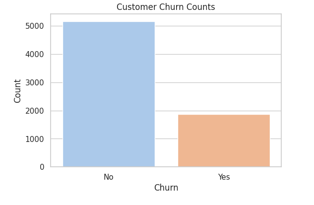

# Customer Churn Analysis
Performed EDA on the Telco Customer Churn dataset using Python (pandas, seaborn, matplotlib).  
Visualized churn trends based on contract type, senior citizens, gender, and more.

## Tools Used
- Python (pandas, seaborn, matplotlib)
- Google Colab

## Dataset
Telco Customer Churn (Kaggle)

## Key Insights
- Customers with month-to-month contracts churn the most
- Senior citizens have a higher churn rate
- 
## 📊 Example Charts

### Churn Distribution

